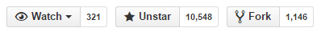

```{r echo=F}
### get knitr just the way we like it

knitr::opts_chunk$set(
  message = FALSE
  , warning = FALSE
  , error = FALSE
  , tidy = FALSE
  , cache = FALSE
)
```

<h3>Now in R as an htmlwidget</h3>

Looking at the Github stats below, I clearly am not the only one who loves [sweetalert](https://github.com/t4t5/sweetalert) by [Tristan Edwards](http://tristanedwards.me).
</img>

Since it is so useful and so beautiful, of course we need it in `R` as an [`htmlwidget`](http://htmlwidgets.org).  Below are all the [demo examples](http://t4t5.github.io/sweetalert) from `sweetalert` recreated in R using the new [`sweetalertR`](https://github.com/timelyportfolio/sweetalertR) htmlwidget.


<h3></h3>
**Please note almost all of the HTML/JS/CSS should be directly attributed to the sweetalert author Tristan Edwards.**
<h3></h3>


<h1 class="headerlogo">Sweet Alert</h1>
<h2>A beautiful replacement for JavaScript's "Alert"</h2>

<!-- What does it do? -->
<h3>So... What does it do?</h3>
<p>Here’s a comparison of a standard error message. The first one uses the built-in <strong>alert</strong>-function, while the second is using <strong>sweetAlert</strong>.</p>

<div class="showcase normal">
<h4>Normal alert</h4>
<button onclick = 'alert("Oops... Something went wrong!")'>Show error message</button>

<h5>Code:</h5>
<pre><span class="attr">alert</span>(<span class="str">"Oops... Something went wrong!"</span>);

</pre>

<div class="vs-icon"></div>
</div>

<div class="showcase sweet">
<h4>Sweet Alert</h4>
<button>Show error message</button>

<h5>Code:</h5>
<!--pre><span class="attr">sweetAlert</span>(<span class="str">"Oops..."</span>, <span class="str">"Something went wrong!"</span>, <span class="str">"error"</span>);</pre-->


```{r}
# instead of copying the code from sweetalert examples
#  let's use R sweetalertR htmlwidgets
library(sweetalertR)

sweetalert(
  selector = '.showcase.sweet button',
	title = "Oops...",
  text = "Something went wrong!",
  type = "error"
)
```
</div>


<p>Pretty cool huh? SweetAlert automatically centers itself on the page and looks great no matter if you're using a desktop computer, mobile or tablet. It's even highly customizeable, as you can see below!</p>


<!-- Examples -->
<h3>More examples</h3>

<p class="center">In these examples, we will use the <code>sweetalert()</code> function from the R htmlwidget <code>sweetalertR</code> instead of <code>swal</code> or <code>sweetAlert</code> in JavaScript.</p>

<ul class="examples">

<li class="message">
<div class="ui">
<p>A basic message</p>
<button>Try me!</button>
</div>
<!--pre><span class="attr">swal</span>(<span class="str">"Here's a message!"</span>)</pre-->
```{r}
sweetalert(
  selector = 'ul.examples li.message button',
	text = "Here's a message!"
)
```
</li>


<li class="title-text">
<div class="ui">
<p>A title with a text under</p>
<button>Try me!</button>
</div>
<!--pre><span class="attr">swal</span>(<span class="str">"Here's a message!"</span>, <span class="str">"It's pretty, isn't it?"</span>)</pre-->
```{r}
sweetalert(
  'ul.examples li.title-text button',
	title = "Here's a message!",
  text = "It's pretty, isn't it?"
)
```
</li>


<li class="success">
<div class="ui">
<p>A success message!</p>
<button>Try me!</button>
</div>
<!--pre><span class="attr">swal</span>(<span class="str">"Good job!"</span>, <span class="str">"You clicked the button!"</span>, <span class="str">"success"</span>)</pre-->
```{r}
sweetalert(
  'ul.examples li.success button',
	title = "Good job!",
  text = "You clicked the button!",
  type = "success"
)
```
</li>


<li class="warning confirm">
<div class="ui">
<p>A warning message, with a function attached to the "Confirm"-button...</p>
<button>Try me!</button>
</div>
<!--pre><span class="attr">swal</span>({
&nbsp;&nbsp;title: <span class="str">"Are you sure?"</span>,
&nbsp;&nbsp;text: <span class="str">"You will not be able to recover this imaginary file!"</span>,
&nbsp;&nbsp;type: <span class="str">"warning"</span>,
&nbsp;&nbsp;showCancelButton: <span class="val">true</span>,
&nbsp;&nbsp;confirmButtonColor: <span class="str">"#DD6B55"</span>,
&nbsp;&nbsp;confirmButtonText: <span class="str">"Yes, delete it!"</span>,
&nbsp;&nbsp;closeOnConfirm: <span class="val">false</span>
},
<span class="func"><i>function</i></span>(){
&nbsp;&nbsp;<span class="attr">swal</span>(<span class="str">"Deleted!"</span>, <span class="str">"Your imaginary file has been deleted."</span>, <span class="str">"success"</span>);
</pre-->

```{r}
sweetalert(
  'ul.examples li.warning.confirm button',
	title = "Are you sure?",
	text = "You will not be able to recover this imaginary file!",
	type = "warning",
	showCancelButton = TRUE,
	confirmButtonColor = '#DD6B55',
	confirmButtonText = 'Yes, delete it!',
	closeOnConfirm = FALSE,
  evalFunction = '
function(){
	swal("Deleted!", "Your imaginary file has been deleted!", "success")
}
  '
)
```
</li>


<li class="warning cancel">
<div class="ui">
<p>... and by passing a parameter, you can execute something else for "Cancel".</p>
<button>Try me!</button>
</div>
<!--pre><span class="attr">swal</span>({
&nbsp;&nbsp;title: <span class="str">"Are you sure?"</span>,
&nbsp;&nbsp;text: <span class="str">"You will not be able to recover this imaginary file!"</span>,
&nbsp;&nbsp;type: <span class="str">"warning"</span>,
&nbsp;&nbsp;showCancelButton: <span class="val">true</span>,
&nbsp;&nbsp;confirmButtonColor: <span class="str">"#DD6B55"</span>,
&nbsp;&nbsp;confirmButtonText: <span class="str">"Yes, delete it!"</span>,
&nbsp;&nbsp;cancelButtonText: <span class="str">"No, cancel plx!"</span>,
&nbsp;&nbsp;closeOnConfirm: <span class="val">false</span>,
&nbsp;&nbsp;closeOnCancel: <span class="val">false</span>
},
<span class="func"><i>function</i></span>(isConfirm){
&nbsp;&nbsp;<span class="tag">if</span> (isConfirm) {
&nbsp;&nbsp;&nbsp;&nbsp;<span class="attr">swal</span>(<span class="str">"Deleted!"</span>, <span class="str">"Your imaginary file has been deleted."</span>, <span class="str">"success"</span>);
&nbsp;&nbsp;} <span class="tag">else</span> {
&nbsp;&nbsp;&nbsp;&nbsp;<span class="attr">swal</span>(<span class="str">"Cancelled"</span>, <span class="str">"Your imaginary file is safe :)"</span>, <span class="str">"error"</span>);
&nbsp;&nbsp;}
</pre-->

```{r}
sweetalert('ul.examples li.warning.cancel button',
	title = "Are you sure?",
	text = "You will not be able to recover this imaginary file!",
	type = "warning",
	showCancelButton = TRUE,
	confirmButtonColor = '#DD6B55',
	confirmButtonText = 'Yes, delete it!',
	cancelButtonText = "No, cancel plx!",
	closeOnConfirm = FALSE,
	closeOnCancel = FALSE,
	evalFunction = '
function(isConfirm){
  if (isConfirm){
    swal("Deleted!", "Your imaginary file has been deleted!", "success")
  } else {
    swal("Cancelled", "Your imaginary file is safe  =)", "error")
  }
}'
)
```

</li>

<li class="custom-icon">
<div class="ui">
<p>A message with a custom icon</p>
<button>Try me!</button>
</div>
<!--pre><span class="attr">swal</span>({
&nbsp;&nbsp;title: <span class="str">"Sweet!"</span>,
&nbsp;&nbsp;text: <span class="str">"Here's a custom image."</span>,
&nbsp;&nbsp;imageUrl: <span class="str">"images/thumbs-up.jpg"</span>
</pre-->


```{r}
sweetalert('ul.examples li.custom-icon button',
	title = "Sweet!",
	text = "Here's a custom image.",
	imageUrl = 'images/thumbs-up.jpg'
)
```

</li>


<li class="message-html">
<div class="ui">
<p>An HTML message</p>
<button>Try me!</button>
</div>
<!--pre><span class="attr">swal</span>({
&nbsp;&nbsp;title: <span class="str">"HTML &lt;small&gt;Title&lt;/small&gt;!"</span>,
&nbsp;&nbsp;text: <span class="str">"A custom &lt;span style="color:#F8BB86"&gt;html&lt;span&gt; message."</span>,
&nbsp;&nbsp;html: <span class="val">true</span>
</pre-->


```{r}
sweetalert('ul.examples li.message-html button',
	title = "HTML <small>Title</small>!",
	text = 'A custom <span style="color:#F8BB86">html<span> message.',
	html = TRUE
)
```

</li>


<li class="timer">
<div class="ui">
<p>A message with auto close timer</p>
<button>Try me!</button>
</div>
<!--pre><span class="attr">swal</span>({
&nbsp;&nbsp;title: <span class="str">"Auto close alert!"</span>,
&nbsp;&nbsp;text: <span class="str">"I will close in 2 seconds."</span>,
&nbsp;&nbsp;timer: <span class="val">2000</span>,
&nbsp;&nbsp;showConfirmButton: <span class="val">false</span>
</pre-->

```{r}
sweetalert(
  'ul.examples li.timer button',
	title = "Auto close alert!",
	text = "I will close in 2 seconds.",
	timer = 2000,
	showConfirmButton = FALSE
)
```


</li>


<li class="input">
<div class="ui">
<p>A replacement for the "prompt" function</p>
<button>Try me!</button>
</div>
<!--pre><span class="attr">swal</span>({
&nbsp;&nbsp;title: <span class="str">"An input!"</span>,
&nbsp;&nbsp;text: <span class="str">"Write something interesting:"</span>,
&nbsp;&nbsp;type: <span class="str">"input"</span>,
&nbsp;&nbsp;showCancelButton: <span class="val">true</span>,
&nbsp;&nbsp;closeOnConfirm: <span class="val">false</span>,
&nbsp;&nbsp;animation: <span class="str">"slide-from-top"</span>,
&nbsp;&nbsp;inputPlaceholder: <span class="str">"Write something"</span>
},
<span class="func"><i>function</i></span>(<span class="arg">inputValue</span>){
&nbsp;&nbsp;<span class="tag">if</span> (inputValue <span class="tag">===</span> <span class="val">false</span>) <span class="tag">return</span> <span class="val">false</span>;
&nbsp;&nbsp;
&nbsp;&nbsp;<span class="tag">if</span> (inputValue <span class="tag">===</span> <span class="str">""</span>) {
&nbsp;&nbsp;&nbsp;&nbsp;swal<span class="tag">.</span><span class="attr">showInputError</span>(<span class="str">"You need to write something!"</span>);
&nbsp;&nbsp;&nbsp;&nbsp;<span class="tag">return</span> <span class="val">false</span>
&nbsp;&nbsp;}
&nbsp;&nbsp;
&nbsp;&nbsp;<span class="attr">swal</span>(<span class="str">"Nice!"</span>, <span class="str">"You wrote: "</span> + inputValue, <span class="str">"success"</span>);
</pre-->

```{r}
sweetalert('ul.examples li.input button',
	title = "An input!",
	text = 'Write something interesting: ',
	type = 'input',
	showCancelButton = TRUE,
	closeOnConfirm = FALSE,
	animation = "slide-from-top",
	inputPlaceholder = "Write something",
	evalFunction = '
function(inputValue){
	if (inputValue === false) return false
	if (inputValue === "") {
		swal.showInputError("You need to write something!")
		return false
	}
	swal("Nice!", "You wrote: " + inputValue, "success")
}
'
)
```


</li>


<li class="theme">
<div class="ui">
<p>You can also change the theme of SweetAlert!</p>
<button>Try me!</button>
</div>
<!--pre>&lt;<span class="tag">link</span> <span class="attr">rel</span>=<span class="str">"stylesheet"</span> <span class="tag">type</span>=<span class="str">"text/css"</span> <span class="tag">href</span>=<span class="str">"dist/sweetalert.css"</span>&gt;
&lt;<span class="tag">link</span> <span class="attr">rel</span>=<span class="str">"stylesheet"</span> <span class="tag">type</span>=<span class="str">"text/css"</span> <span class="tag">href</span>=<span class="str">"themes/twitter.css"</span>&gt;</pre-->


```{r}
sweetalert('ul.examples li.theme button',
	title = "Themes!",
	text = "Here's the Twitter theme for SweetAlert!",
	confirmButtonText = "Cool!",
	customClass = 'twitter'
)
```


</li>


</ul>


<!-- Download & Install -->
<h3 id="download-section">Download & install</h3>

<div class="center-container">
<p class="center"> Install with devtools::install_github:</p>
<pre class="center">devtools::install_github("timelyportfolio/sweetalertR")</pre>
</div>


<!-- Configuration -->
<h3>Configuration</h3>

<p class="center">Here are the keys that you can use if you pass an object into sweetAlert:</p>

<table>
<tr class="titles">
<th>
<div class="border-left"></div>
Argument
</th>
<th>Default value</th>
<th>
<div class="border-right"></div>
Description
</th>
</tr>
<tr>
<td><b>title</b></td>
<td><i>null (required)</i></td>
<td>The title of the modal. It can either be added to the object under the key "title" or passed as the first parameter of the function.</td>
</tr>
<tr>
<td><b>text</b></td>
<td><i>null</i></td>
<td>A description for the modal. It can either be added to the object under the key "text" or passed as the second parameter of the function.</td>
</tr>
<tr>
<td><b>type</b></td>
<td><i>null</i></td>
<td>The type of the modal. SweetAlert comes with 4 built-in types which will show a corresponding icon animation: "<strong>warning</strong>", "<strong>error</strong>", "<strong>success</strong>" and "<strong>info"</strong>. You can also set it as "<strong>input</strong>" to get a prompt modal. It can either be put in the object under the key "type" or passed as the third parameter of the function.</td>
</tr>
<tr>
<td><b>allowEscapeKey</b></td>
<td><i>true</i></td>
<td>If set to <strong>true</strong>, the user can dismiss the modal by pressing the Escape key.</td>
</tr>
<tr>
<td><b>customClass</b></td>
<td><i>null</i></td>
<td>A custom CSS class for the modal. It can be added to the object under the key "customClass".</td>
</tr>
<tr>
<td><b>allowOutsideClick</b></td>
<td><i>false</i></td>
<td>If set to <strong>true</strong>, the user can dismiss the modal by clicking outside it.</td>
</tr>
<tr>
<td><b>showCancelButton</b></td>
<td><i>false</i></td>
<td>If set to <strong>true</strong>, a "Cancel"-button will be shown, which the user can click on to dismiss the modal.</td>
</tr>
<tr>
<td><b>showConfirmButton</b></td>
<td><i>true</i></td>
<td>If set to <strong>false</strong>, the "OK/Confirm"-button will be hidden. Make sure you set a timer or set allowOutsideClick to true when using this, in order not to annoy the user.</td>
</tr>
<tr>
<td><b>confirmButtonText</b></td>
<td><i>"OK"</i></td>
<td>Use this to change the text on the "Confirm"-button. If showCancelButton is set as true, the confirm button will automatically show "Confirm" instead of "OK".</td>
</tr>
<tr>
<td><b>confirmButtonColor</b></td>
<td><i>"#AEDEF4"</i></td>
<td>Use this to change the background color of the "Confirm"-button (must be a HEX value).</td>
</tr>
<tr>
<td><b>cancelButtonText</b></td>
<td><i>"Cancel"</i></td>
<td>Use this to change the text on the "Cancel"-button.</td>
</tr>
<tr>
<td><b>closeOnConfirm</b></td>
<td><i>true</i></td>
<td>Set to <i>false</i> if you want the modal to stay open even if the user presses the "Confirm"-button. This is especially useful if the function attached to the "Confirm"-button is another SweetAlert.</td>
</tr>
<tr>
<td><b>closeOnCancel</b></td>
<td><i>true</i></td>
<td>Same as closeOnConfirm, but for the cancel button.</td>
</tr>
<tr>
<td><b>imageUrl</b></td>
<td><i>null</i></td>
<td>Add a customized icon for the modal. Should contain a string with the path to the image.</td>
</tr>
<tr>
<td><b>imageSize</b></td>
<td><i>"80x80"</i></td>
<td>If imageUrl is set, you can specify imageSize to describes how big you want the icon to be in px. Pass in a string with two values separated by an "x". The first value is the width, the second is the height.</td>
</tr>
<tr>
<td><b>timer</b></td>
<td><i>null</i></td>
<td>Auto close timer of the modal. Set in ms (milliseconds).</td>
</tr>
<tr>
<td><b>html</b></td>
<td><i>false</i></td>
<td>If set to true, will not escape title and text parameters. (Set to false if you're worried about XSS attacks.)</td>
</tr>
<tr>
<td><b>animation</b></td>
<td><i>true</i></td>
<td>If set to <strong>false</strong>, the modal's animation will be disabled.</td>
</tr>
<tr>
<td><b>inputType</b></td>
<td><i>"text"</i></td>
<td>Change the type of the input field when using <strong>type: "input"</strong> (this can be useful if you want users to type in their password for example).</td>
</tr>
<tr>
<td><b>inputPlaceholder</b></td>
<td><i>null</i></td>
<td>When using the input-type, you can specify a placeholder to help the user.</td>
</tr>
<tr>
<td><b>inputValue</b></td>
<td><i>null</i></td>
<td>Specify a default text value that you want your input to show when using <strong>type: "input"</strong></td>
</tr>
</table>


<!-- Contribute -->
<h3>Contribute</h3>
<p>SweetAlert was created by <a href="http://tristanedwards.me" target="_blank">Tristan Edwards</a>, you can follow him on <a href="https://twitter.com/t4t5" target="_blank" class="twitter">Twitter</a> or <a href="https://dribbble.com/tristanedwards" target="_blank" class="dribbble">Dribbble</a> for updates and other cool projects!</p>
<p>Feel free to fork SweetAlert on <a href="https://github.com/t4t5/sweetalert" class="github">GitHub</a> if you have any features that you want to add!</p>

[`sweetalertR`](https://github.com/timelyportfolio/sweetalertR) was created by Kenton Russell to wrap SweetAlert and make it available in `R` as an `htmlwidget`. 


<footer>
<span class="te-logo">TE</span> • <script>document.write(new Date().getFullYear())</script>
</footer>

